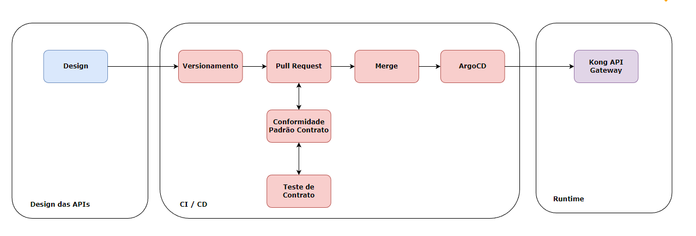
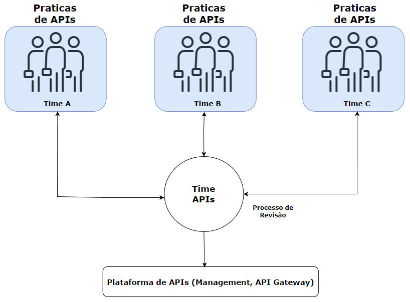
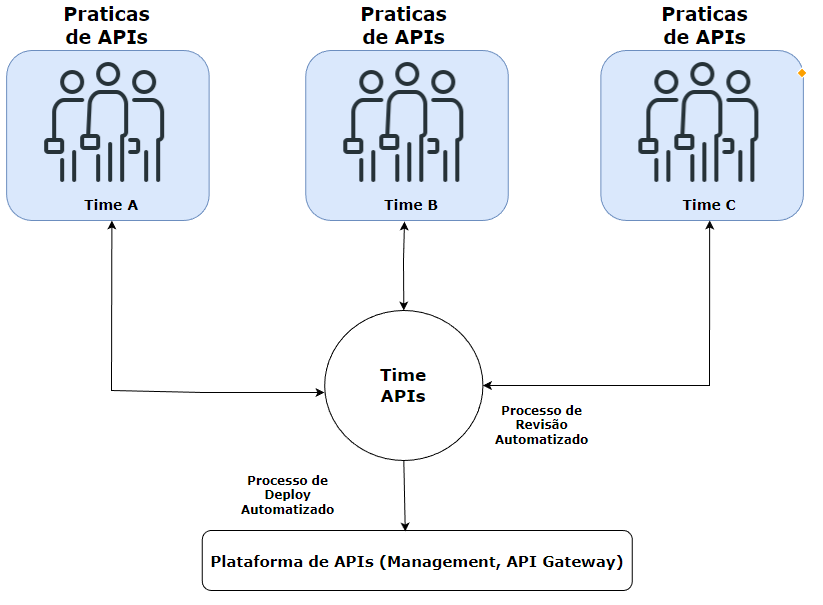
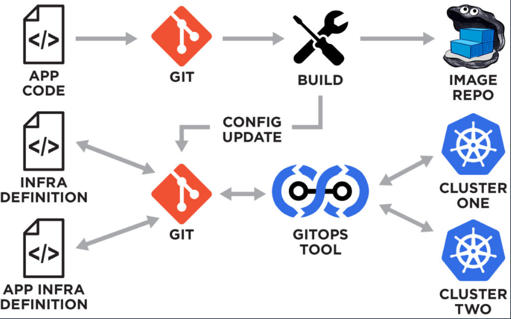

# Kong API Gateway e Kubernetes

## Conceitos Básicos

- Aula 1: Principais conceitos
    - Principais objetos de manipulação do Kong
        - Rotas
        - Services
        - Plugins
        - Consumers
        - Upstreams
        - Targets
    

- Aula 2: Kubernetes ingress kong
    - Kubernetes Ingress
    É a maneira de realizar a exposição de rotas HTTP e HTTPS para fora do cluster. Este roteamento de tráfego é controlado por regras definidas dentro do recurso Ingress do Kubernetes
    
    - Kong & Kubernetes Ingress
    
    - Tradução K8s -> Kong
    

- Aula 3: Modelos deployment kong kubernetes
    - Kong API Gateway - Banco de Dados K8s
    
    - Kong API Gateway DB-Less K8s
    

- Aula 4: Instalando Kong
    - Criando um cluster de K8s
        - Ferramentas que serão utilizadas
            - Kind || minikube || microk8s
            - kubectl
            - Helm v3
    ```
    kind create cluster --name kong-fc --config clusterconfig.yaml
    ```
    ```
    kubectl create ns kong
    ```
    ```
    choco install kubernetes-helm
    ```
    ```
    helm repo add kong https://charts.konghq.com
    ```
    ```
    helm repo update
    ```
    ```
    helm install kong kong/kong -f kong-conf.yaml --set proxy.type=NodePort,proxy.http.nodePort=30000,proxy.tls.nodePort=30003 --set ingressController.installCRDs=false --set serviceMonitor.enabled=true --set serviceMonitor.labels.release=promstack --namespace kong
    ```
    ```
    kubectl logs NOMEDOPOD proxy -n kong
    ```

- Aula 5: Ferramentas adicionais
    - Instalando ferramentas
    ```
    kubectl create ns monitoring
    ```
    ```
    helm repo add prometheus-community https://prometheus-community.github.io/helm-charts
    ```
    ```
    helm repo update
    ```
    ```
    helm install prometheus-stack prometheus-community/kube-prometheus-stack -f prometheus.yaml --namespace monitoring
    ```
    ```
    kubectl create ns iam
    ```
    ```
    helm repo add bitnami https://charts.bitnami.com/bitnami
    ```
    ```
    helm repo update
    ```
    ```
    helm install keycloak bitnami/keycloak --set auth.adminUser=keycloak,auth.adminPassword=keycloak --namespace iam
    ```
    - Criação da pasta "apps" e diversos arquivos yaml
    ```
    kubectl create ns bets
    ```
    ```
    kubectl apply -f .\apps\ --recursive -n bets
    ```

## Kong & Kubernetes

- Aula 6: Crd plugins
    - Kong Custom Resource Definitions <https://docs.konghq.com/kubernetes-ingress-controller/latest/concepts/custom-resources/>
    - Criado os primeiros manifestos:
    ```
    kubectl apply -f .\krate-limit.yaml -n bets
    ```
    ```
    kubectl apply -f .\kprometheus.yaml
    ```

- Aula 7: Kong ingress
    - Kong ingress
    - Criado mais alguns manifestos
    ```
    kubectl apply -f .\bets-api.yaml -n bets
    ```
    ```
    kubectl apply -f .\kingress.yaml -n bets
    ```

- Aula 8: Open id provider
    - Kong + OpenID Connect
    ```
    kubectl port-forward svc/keycloak 8080:80 -n iam
    ```
    - Criando usuários, realm e client pelo Keycloak
    ```
    kubectl port-forward svc/keycloak 8080:80 -n iam
    ```
    ```
    http://localhost:8080
    ```

- Aula 9: Kong openid plugin
    ```
    kubectl apply -f .\kopenid.yaml -n bets
    ```
    ```
    kubectl apply -f .\pod.yaml
    ```
    ```
    kubectl exec -it testcurl -- sh
    ```
    ```
    curl --location --request POST 'http://keycloak.iam/realms/bets/protocol/openid-connect/token' \
    --header 'Content-Type: application/x-www-form-urlencoded' \
    --data-urlencode 'client_id=kong' \
    --data-urlencode 'grant_type=password' \
    --data-urlencode 'username=maria' \
    --data-urlencode 'password=maria' \
    --data-urlencode 'client_secret=DounaAGzGKoWNkx70DqAYF8szsGOadhM' \
    --data-urlencode 'scope=openid'
    ```

## APIOps

- Aula 10: APIOps
    - É um conceito que aplica os solidos e testados principios de DevOps e GitOps para o ciclo de vida das APIs e microsserviços.
    
    
    

- Aula 11: GitOps
    - É uma prática que usa infraestrutura como código, que implica que um determinado ambiente (dev, homologação, prod) esteja criado em uma maneira declarativa através de manifestos, e que através de automação seja possível recriar o ambiente de maneira repetitiva.
    Os manifestos devem estar armazenados dentro de um repositório git.
    

- Aula 12: Ferramentas necessárias
    - Github Actions
    - Spectral <https://stoplight.io/open-source/spectral>
    - Postman <https://learning.postman.com/docs/writing-scripts/test-scripts/>
    - ArgoCD <https://argoproj.github.io/cd/>

- Aula 13: Validando openapi lint
    - Criando arquivos de contrato (arquivos encontravam-se dentro do repositório pessoal do Claudio <https://github.com/claudioed/bets-app>)

- Aula 14: Checando contratos
    - Mostrou na prática na checagem dos contratos

- Aula 15: Instalando ArgoCD
    - Link para documentação do ArgoCD <https://argo-cd.readthedocs.io/en/stable/getting_started/>
    ```
    kubectl create namespace argocd     
    ```
    ```
    kubectl apply -n argocd -f https://raw.githubusercontent.com/argoproj/argo-cd/stable/manifests/install.yaml
    ```
    ```
    kubectl get po -n argocd
    ```
    ```
    kubectl port-forward svc/argocd-server -n argocd 8080:443
    ```
    ```
    kubectl -n argocd get secret argocd-initial-admin-secret -o jsonpath="{.data.password}" | base64 -d
    ```

- Aula 16: Rodando Pipeline
    - Fiz o fork dos repositórios e os manifestos se encontram dentro de "Code/argo-apps"
    ```
    kubectl apply -f .\players.yaml -n argocd
    ```
    ```
    kubectl apply -f .\matches.yaml -n argocd
    ```
    ```
    kubectl apply -f .\championships.yaml -n argocd
    ```
    ```
    kubectl apply -f .\bets.yaml -n argocd
    ```

- Aula 17: K6 testkube
    - Iniciando com Load Tests <https://k6.io/>
    - Instalando testkube <https://testkube.io/download>
    - Instalação via chocolatey (Não consegui avançar via chocolatey)
    ```
    choco source add --name=testkube_repo --source=http://chocolatey.testkube.io/chocolatey
    ```
    ```
    choco install testkube
    ```
    - Instalando testkube via helm
    ```
    helm repo add kubeshop https://kubeshop.github.io/helm-charts
    ```
    ```
    helm install --create-namespace my-testkube kubeshop/testkube
    ```
    ```
    kubectl get po
    ```

- Aula 18: Preparando o Cluster
    - Instalando metrics servers. Verificar instalação do metrics server com opção de "TLS false"
    ```
    helm repo add metrics-server https://kubernetes-sigs.github.io/metrics-server/
    ```
    ```
    helm upgrade --install metrics-server metrics-server/metrics-server --namespace kube-system
    ```
    - Aplicando manifestos de HPA
    ```
    kubectl apply -f .\hpa\ --recursive -n bets
    ```
    ```
    helm list -A
    ```
    ```
    helm delete prometheus-stack -n monitoring
    ```
    ```
    helm install prometheus-stack prometheus-community/kube-prometheus-stack -f prometheus.yaml --namespace monitoring
    ```
    ```
    kubectl apply -f .\hpa\ --recursive -n bets
    ```

- Aula 19: Aplicando cargas
    - Acessando o grafana (admin - prom-operator) (dashboard do Kong - importar por código 7424)
    ```
    kubectl get svc -n monitoring
    ```
    ```
    kubectl port-forward svc/prometheus-stack-grafana -n argocd 3000:80 -n monitoring
    ```
    - Criando teste de carga
    ```
    kubectl testkube create test --file .\Code\load\create_bet_load.js --type k6/script --name create-bet-load
    ```
    ```
    kubectl testkube run test create-bet-load -f
    ```

## Kong em ambientes produtivos

- Aula 20: Configurando apps logs
    - Instalando conjunto de ferramentas EFK (Elastic - FluentD - Kibana)
    ```
    kubectl create namespace logs
    ```
    ```
    helm repo add elastic https://helm.elastic.co
    ```
    ```
    helm install elasticsearch elastic/elasticsearch --version=7.17.1 -n logs -f elastic-values.yaml
    ```
    - Dando erro na instalação do elastic (Pesquisar)
    ```
    helm install --replace elasticsearch elastic/elasticsearch --version=8.5.1 -n logs -f elastic-values.yaml
    ```
    ```
    helm repo add fluent https://fluent.github.io/helm-charts
    ```
    - Dando erro na instalação do fluentd (Pesquisar)
    ```
    helm install fluentd fluent/fluentd --namespace=logs -f fluentd-values.yaml
    ```

- Aula 21: Configurando coleta de logs kong
    - Configurando o envio de logs nos manifestos
    ```
    kubectl port-forward svc/kibana-kibana 5601 -n logs
    ```

- Aula 22: Analisando Kong
    - Nesse último vídeo ele mostrou os logs do EFK.
    - Fiz uma cópia do repositório <https://github.com/devfullcycle/FC3-kong-automation> e substitui os meus arquivos de manifestos.
    - Em outro momento, caso necessário, refarei esse curso para melhor entendimento.


