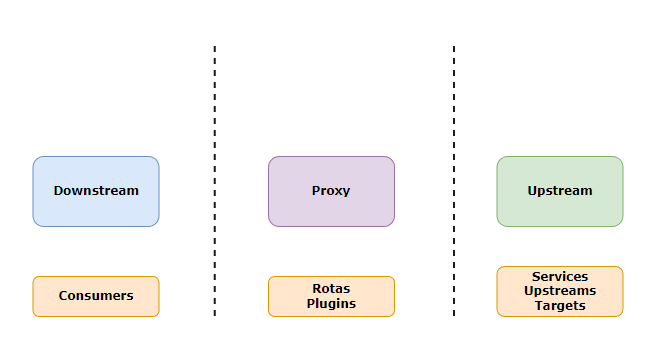
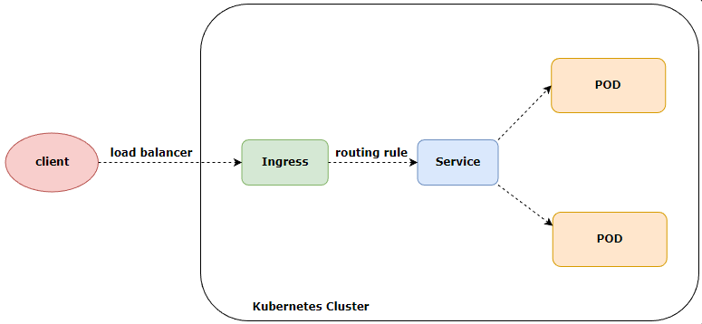
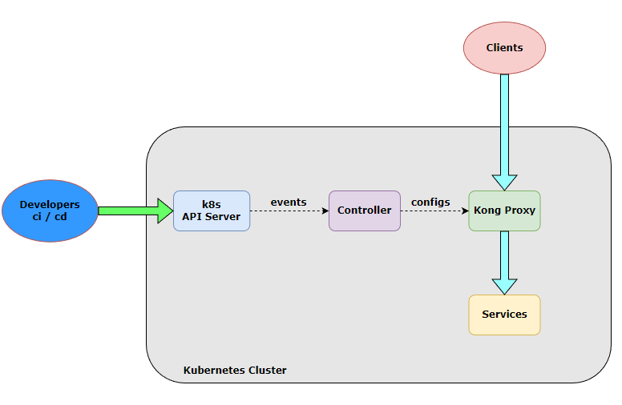
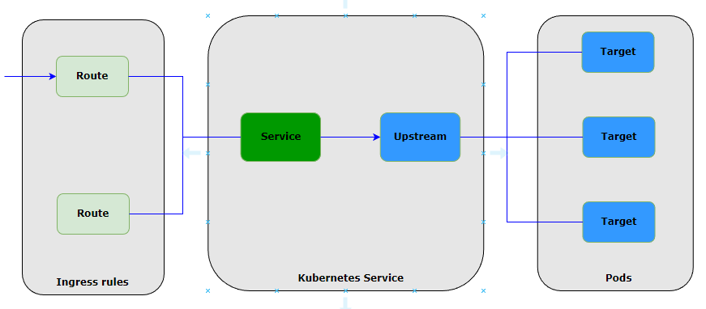
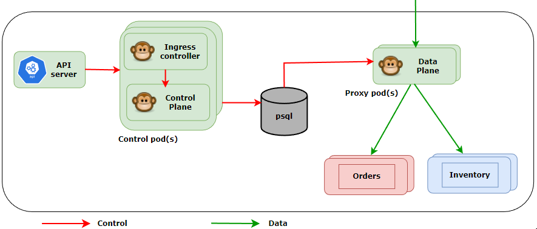
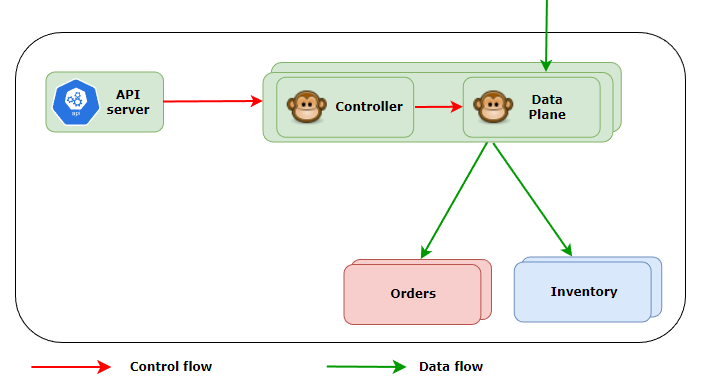

# Kong API Gateway e Kubernetes

## Conceitos Básicos

- Aula 1: Principais conceitos
    - Principais objetos de manipulação do Kong
        - Rotas
        - Services
        - Plugins
        - Consumers
        - Upstreams
        - Targets
    

- Aula 2: Kubernetes ingress kong
    - Kubernetes Ingress
    É a maneira de realizar a exposição de rotas HTTP e HTTPS para fora do cluster. Este roteamento de tráfego é controlado por regras definidas dentro do recurso Ingress do Kubernetes
    
    - Kong & Kubernetes Ingress
    
    - Tradução K8s -> Kong
    

- Aula 3: Modelos deployment kong kubernetes
    - Kong API Gateway - Banco de Dados K8s
    
    - Kong API Gateway DB-Less K8s
    

- Aula 4: Instalando Kong
    - Criando um cluster de K8s
        - Ferramentas que serão utilizadas
            - Kind || minikube || microk8s
            - kubectl
            - Helm v3
    ```
    kind create cluster --name kong-fc --config clusterconfig.yaml
    ```
    ```
    kubectl create ns kong
    ```
    ```
    choco install kubernetes-helm
    ```
    ```
    helm repo add kong https://charts.konghq.com
    ```
    ```
    helm repo update
    ```
    ```
    helm install kong kong/kong -f kong-conf.yaml --set proxy.type=NodePort,proxy.http.nodePort=30000,proxy.tls.nodePort=30003 --set ingressController.installCRDs=false --set serviceMonitor.enabled=true --set serviceMonitor.labels.release=promstack --namespace kong
    ```
    ```
    kubectl logs NOMEDOPOD proxy -n kong
    ```

- Aula 5: Ferramentas adicionais
    - Instalando ferramentas
    ```
    kubectl create ns monitoring
    ```
    ```
    helm repo add prometheus-community https://prometheus-community.github.io/helm-charts
    ```
    ```
    helm repo update
    ```
    ```
    helm install prometheus-stack prometheus-community/kube-prometheus-stack -f prometheus.yaml --namespace monitoring
    ```
    ```
    kubectl create ns iam
    ```
    ```
    helm repo add bitnami https://charts.bitnami.com/bitnami
    ```
    ```
    helm repo update
    ```
    ```
    helm install keycloak bitnami/keycloak --set auth.adminUser=keycloak,auth.adminPassword=keycloak --namespace iam
    ```
    - Criação da pasta "apps" e diversos arquivos yaml
    ```
    kubectl create ns bets
    ```
    ```
    kubectl apply -f .\apps\ --recursive -n bets
    ```